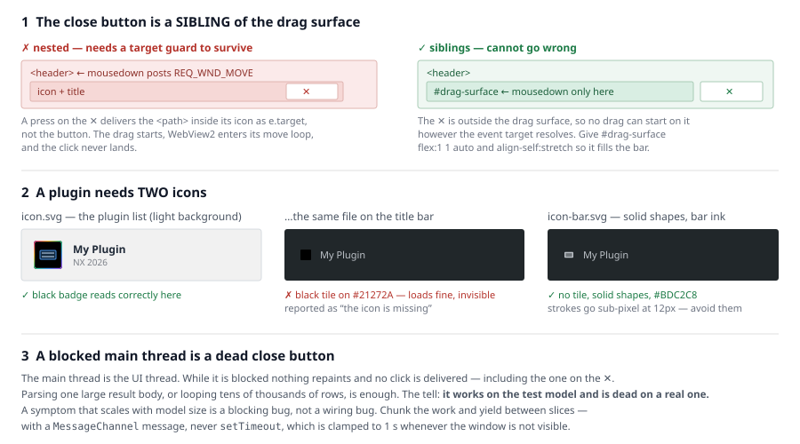

# The plugin host contract

CIVIL NX opens the plugin in an embedded **WebView2** browser window. There is no
SDK. The whole contract is: a query string in, two messages out, and a manifest
that sizes the window.

## What the host gives the plugin

```
index.html?mapiKey=<key>&redirectTo=<base url>
```

```js
const params  = new URLSearchParams(location.search);
const key     = params.get("mapiKey") || "";
const base    = (params.get("redirectTo") || DEFAULT_BASE).replace(/\/+$/, "");
```

A base remembered in `localStorage` must **never** override `?redirectTo=`.

## What the plugin sends the host

Via `chrome.webview.postMessage`, as bare strings:

| Message | Effect |
|---|---|
| `REQ_WND_MOVE` | begin dragging the plugin window |
| `REQ_EXIT` | close the plugin window |

### The close button is not optional

**Every plugin must draw its own close control.** The host gives the plugin
window no browser chrome and no system title bar, so the only ✕ a user gets is
the one the page renders. A plugin without one cannot be dismissed from inside:
the user drags it out of the way, or kills it from CIVIL NX.

This is the **most common omission when a plugin is scaffolded by hand instead of
copied from `assets/template/`.** The API work is the interesting part and the
window shell is not, so the shell never gets written — and nothing catches it,
because every rule below about *how* to wire the controls passes vacuously on a
plugin that has no controls at all. Check existence before correctness:

- a close control is present and visible without scrolling,
- it posts `REQ_EXIT`,
- the header is a drag surface,
- `document.title` is set, because the host displays it.

`window.close()` is **not** the host mechanism. Keep it only where the template
keeps it — for the plain-browser development case — never as the primary path.

### Three ways a correctly-wired close button still fails

Getting `REQ_EXIT` onto the right element is the easy half. All three of these
were found on one shipped plugin, in this order, each after the previous "fix"
was pronounced done — so check all three before believing the button works.



**1. The ✕ is inside the drag surface.** The natural markup puts the header
controls inside the header, and the header is the thing you bind `mousedown` to.
Now a press on the ✕ is also a press on the drag surface, and you are relying on
`e.target.closest("button, …")` to exclude it. That guard has to reach through
whatever is *inside* the button: give the ✕ an SVG icon, as every real plugin
does, and `e.target` is the `<path>`, not the button. When the guard misses, the
drag starts, WebView2 enters its window-move modal loop, and the click never
lands.

**Build it the way MIDAS does:** their own moaui title bar puts the drag `<div>`
and the close control side by side, as siblings, so a drag cannot start on the ✕
however the target resolves. Then give the drag surface `flex: 1 1 auto` **and
`align-self: stretch`** — a header that centres its children leaves it short of
the bar's full height, and the strips above and below it drag nothing, which
reads as an intermittently broken title bar.

Assert the structure in the offline suite. A checklist item asking whether close
is wired *correctly* passes on markup that is one refactor away from breaking:

```js
const drag = /<div id="drag-surface"[\s\S]*?<\/div>/.exec(html);
assert.ok(!/id="btn-close"/.test(drag[0]),
  "the close button is INSIDE the drag surface; a drag can start on it");
```

**2. The bridge is missing and nothing says so.** `window.close()` is a **no-op
in WebView2**, so a `catch` that falls back to it produces a button that does
nothing at all, which is indistinguishable from one that was never wired —
and is exactly how users report it. Route every host message through one helper
that *detects* an absent bridge rather than relying on a thrown exception, and
make an unhonoured `REQ_EXIT` say so on screen:

```js
function toHost(message) {
  var w = root.chrome && root.chrome.webview;
  if (!w || typeof w.postMessage !== "function") return false;
  try { w.postMessage(message); return true; } catch (e) { return false; }
}
```

Then set a ~800 ms timer after posting `REQ_EXIT` that shows an error. In the
host a successful close destroys the window long before it fires, so the message
only ever appears when something is genuinely wrong.

**3. THE MAIN THREAD IS BLOCKED.** This is the one that costs the most time,
because the button is perfectly wired and the fault is somewhere else entirely.
The main thread is the UI thread: while it is blocked nothing repaints and **no
click is delivered**, including the one on the ✕. Parsing one large
`/post/TABLE` body, or looping over tens of thousands of result rows, or running
a synchronous Pyodide call, is enough to freeze the window for minutes.

**The tell is that it works on the small test model and is dead on a real one.**
A symptom that scales with model size is a blocking bug, not a wiring bug — stop
re-reading the handler and go looking for the block.

The fix is to chunk the work and yield between slices. **Yield with a
`MessageChannel` message, not `setTimeout`:**

- a resolved promise is a **microtask** and does not yield to input at all;
- `setTimeout(…, 0)` is a macrotask but is **clamped to one second** whenever the
  window is not visible — measured on this host, a chain of zero-delay timeouts
  ran at 1.00 s intervals — so a few hundred timer yields become minutes of pure
  waiting the moment the user clicks away from the plugin;
- a `MessageChannel` message is a macrotask and is **not** throttled.

`assets/template/js/app.js` ships `yieldToUi()` and `runChunked()` built this
way. Measured on a run that made 525 core calls: **max UI block 21 ms, median 0**.

**Measuring this is easy to get wrong.** A `setInterval`/`setTimeout` probe is
itself clamped in a hidden window and will report a 1000 ms freeze that is not
real. Probe with the same `MessageChannel` primitive, and check the run actually
finished inside the window you sampled.

**`REQ_MOVE` is ignored.** One plugin's title bar did nothing for months because
it sent `REQ_MOVE` — while `REQ_EXIT` was right, so the close button worked and
hid the problem.

**`REQ_WND_MOVE` must be posted from a `mousedown` handler.** From
`pointerdown` it does nothing at all, while `REQ_EXIT` from the same bridge keeps
working — so the bridge looks healthy. Gate on the button so a right-click on the
header does not start a drag and swallow the context menu:

```js
header.addEventListener("mousedown", (e) => {
  if (e.button !== 0 && e.button !== 1) return;
  if (e.target.closest("button, input, select, nav, a")) return;
  try { chrome.webview.postMessage("REQ_WND_MOVE"); } catch (_) { /* not hosted */ }
});
```

Always wrap in try/catch — outside the host, `chrome.webview` does not exist and
the plugin must still run in a plain browser for development.

**When a host integration looks wrong, grep a MIDAS-shipped plugin before
guessing.** The authority for both messages is MIDAS's own Load Combination
Analyzer bundle, which posts `REQ_WND_MOVE` from its title bar's `onMouseDown`.

## manifest.json

```json
{
  "short_name": "MyPlugin",
  "name": "My Plugin",
  "version": "1.0.0",
  "description": "One sentence the plugin list will show.",
  "icons": [
    { "src": "favicon.ico", "sizes": "16x16 32x32 48x48 64x64", "type": "image/x-icon" },
    { "src": "icon.svg", "sizes": "any", "type": "image/svg+xml" }
  ],
  "start_url": ".",
  "display": "standalone",
  "theme_color": "#ffffff",
  "background_color": "#eef0f2",
  "width": 1280,
  "height": 760
}
```

`width` / `height` size the plugin window. **1280×760 is a sensible ceiling** —
one plugin shipped at 1180×900 and was cut back because it covered too much of
CIVIL NX to be usable beside the model.

## Packaging

**Files go at the zip root.** `index.html` must be a top-level entry, not inside
a folder.

**Do not use `Compress-Archive` on Windows PowerShell 5.1.** It writes
`vendor\file.js` with backslash separators, which the ZIP spec forbids and which
can stop a subfolder unpacking in the host. Build the archive entry by entry
through .NET with the separator set explicitly — `assets/scripts/pack.ps1` does
this, and `verify-zip.ps1` then confirms every entry matches the source file
hash for hash, and that no development-only file leaked in.

Ship a **versioned** zip and leave earlier versions in place; users run the
plugin from the zip and an overwritten version destroys their rollback. Keep the
version in step across `manifest.json`, the header line in `index.html`, the
readme, and any metadata the plugin writes into its own output.

## WebView2 quirks that bite

- **A hidden or backgrounded plugin window throttles timers to about 1/s.**
  Exports that yield per figure take minutes instead of seconds. It is not a
  hang — measure with the window displayed, and yield with a `MessageChannel`
  message rather than a timer, which is not throttled. See the close-button
  section above.
- **`requestAnimationFrame` is suspended when the window is not compositing.**
  Race every rAF against a timer.
- **Nothing in either shipped combination plugin had ever downloaded or opened a
  file**, so whether the host window permits a download is *unverified*. If the
  plugin exports, provide a "show as text" fallback box that the user can copy
  from, and fall back to it when a save is blocked.
- Storage is per-plugin and survives, so `localStorage` is fine for settings —
  but **never cache the model**. A restored copy looks identical to a fresh one
  while describing whatever was open when the window closed.

## Rebuilding or patching a shipped plugin

MIDAS's own plugins ship as **production bundles with no source and no source
map** (esbuild or webpack). Patching one is legitimate and works, with two rules:

1. **Locate every site by code *shape*, not by identifier name.** Both
   toolchains rename locals between builds, so a patch anchored on names breaks
   on the very next release. Write the patch as a script that discovers its
   anchors by regex on structure and **aborts without writing** if any site is
   not found exactly once.
2. **Run `node --check` on the patched bundle before writing it.** A malformed
   injection otherwise surfaces only as a blank panel in the browser.

Keep the patch script, not just the patched file — the developer's next build
overwrites everything.

### Verifying a patch without CIVIL NX

**A React-based plugin's `#root` never mounts outside the MIDAS host — an empty
page is not a patch failure.** Serving the extracted folder as a static site
leaves `#root` empty in the *unpatched* build too, so the blank panel proves
nothing either way and has been misread as a broken patch more than once.

What does work, with the folder served over HTTP:

- `node --check` on the bundle — catches the malformed injection.
- Expose the patched helpers on `globalThis` (`globalThis.__myPatch = {...}`)
  and call them from the page console. They are reachable even though the app
  never mounts, so the new logic can be unit-tested against real inputs.
- `eval` the injected helper block directly in node for bulk cases — a
  3000-row stress run over a naming fitter takes seconds and proves uniqueness
  and length compliance before the plugin ever opens.

Discover the bundle's own running counters by shape and reuse them rather than
introducing new ones, so anything the patch renames stays unique against records
the unpatched code also writes.
